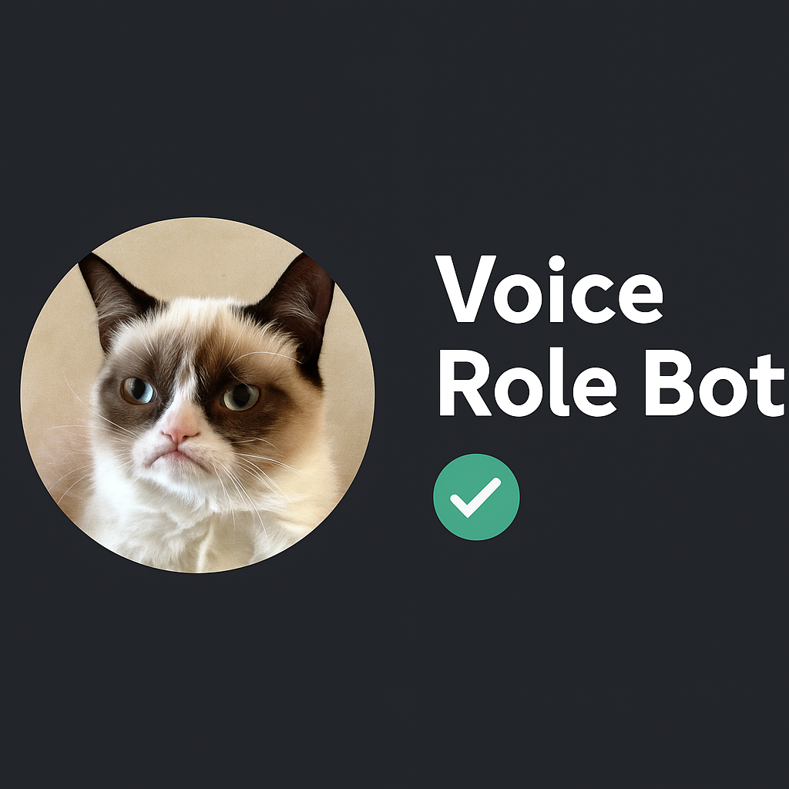

# Voice Role Bot

## 📢 Опис
Voice Role Bot - це Discord бот, який автоматично відтворює звукові ефекти, коли користувачі заходять у голосові канали. Кожен звуковий ефект прив'язується до конкретної ролі користувача.

## 🔥 Основні функції
- 🎵 Відтворення звуків при вході в голосовий канал
- 🎧 Прив'язка аудіофайлів до ролей Discord
- 🧹 Автоматичне видалення повідомлень у визначеному каналі

## 📋 Вимоги
- Node.js 16 або новіше
- Discord сервер з правами адміністратора для бота
- Ролі Discord для користувачів

## 🔧 Налаштування

### Файл .env
Створіть файл `.env` в кореневій папці проекту:
TOKEN=ваш_токен_discord_бота

### Встановлення залежностей
bash npm install discord.js @discordjs/voice dotenv axios

### Структура папок
Створіть папку `mp3` в кореневій папці проекту для зберігання аудіофайлів.

## 📚 Використання

### Команди користувача
- `!help` або `!info` - Показати інформацію про бота та доступні команди
- `/addvoice <назва_ролі>` - Додати аудіофайл для ролі (потрібно прикріпити .mp3 або .ogg файл)

### Приклади використання
1. Прив'язка звуку до ролі:
    - Напишіть `/addvoice Модератор` і прикріпіть .mp3 файл
    - Тепер, коли користувач з роллю "Модератор" зайде в голосовий канал, відтвориться цей звук

2. Перевірка роботи:
    - Просто вийдіть і зайдіть знову у голосовий канал

### Обмеження
- Користувачі можуть прив'язувати звуки лише до тих ролей, які вони мають
- Підтримуються тільки формати `.mp3` та `.ogg`
- Один аудіофайл для однієї ролі

## 🛠️ Налаштування для адміністраторів

### Автоочищення каналу
Бот автоматично видаляє повідомлення старіші за 24 години у вказаному каналі. Щоб змінити канал для автоочищення, відредагуйте значення `AUTO_DELETE_CHANNEL_ID` у файлі бота.

# 🎧 Voice Role Bot

<div align="center">
  
  <h3>Discord бот для програвання персоналізованих звуків при вході в голосовий канал</h3>
  <p><b>Версія 2.1.0</b></p>
</div>

## 🚀 Функції

- 🔊 **Вітальні звуки**: Програвання персоналізованого звуку при вході в голосовий канал
- 🧩 **Прив'язка до ролей**: Кожна роль може мати свій унікальний звук
- 🎛️ **Slash-команди**: Зручний інтерфейс команд для керування ботом
- 🧹 **Автоочищення**: Автоматичне видалення старих повідомлень
- 🔐 **Безпека**: Захист від несанкціонованої зміни звуків
- 🔄 **Оновлення WebHook**: Автоматичне оновлення інформаційного повідомлення

## ✨ Що нового у версії 2.1.0

- 🛡️ Покращена стійкість до помилок при запуску
- 🗑️ Оптимізовано систему автоматичного видалення повідомлень
- 🎚️ Додано обмеження розміру аудіофайлів (2 МБ)
- 🧰 Додано команду `/removevoice` для видалення аудіо
- 📊 Автоматичне відображення доступних звуків у WebHook
- 🔧 Оптимізовано команду `/clean` для більш ефективного очищення чату

## 🛠️ Встановлення та налаштування

### Вимоги
- Node.js 16.9.0 або новіше
- npm пакетний менеджер
- Токен Discord бота з відповідними правами

### Кроки встановлення

1. Клонуйте репозиторій:
```bash
git clone https://github.com/username/voice-role-bot.git
cd voice-role-bot

